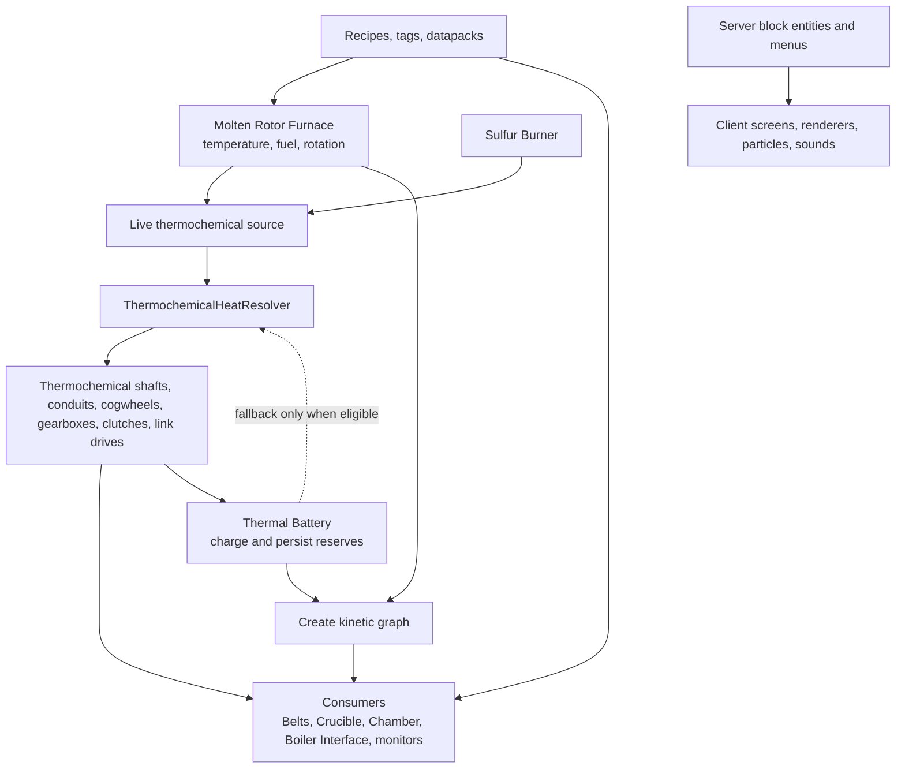

# CSR architecture

## Purpose and scope

Create: Sulfuric Resonance (CSR) is a NeoForge 1.21.1 addon for Create. It adds a thermochemical heat graph alongside Create's kinetic graph, then uses both graphs to drive industrial machines, processing, monitoring, and presentation.

The key design fact is: **thermochemical heat and Create rotation are related, but they are not the same graph.** Do not use an apparent shaft connection, a running renderer, or kinetic propagation alone as proof that thermochemical heat is available.

## Top-level map

## Boot and registration

`CreateSulfuricResonance` is the composition root. It registers content, block entities, menus, fluids, effects, sounds, recipe types, arm integration, capabilities, payloads, config, and client Ponder setup. Do not put machine behavior in this class.

Primary registry locations:

| Concern | Owner |
| --- | --- |
| Items and block items | `content/Items.java` |
| Blocks | `content/registry/AllModBlocks.java` |
| Block entities | `content/registry/AllBlockEntities.java` |
| Menus | `content/registry/AllModMenus.java` |
| Fluids/effects/sounds/particles | `content/registry/AllModFluids`, `AllModEffects`, `AllModSounds`, `ModParticles` |
| Recipe types | `content/recipes/*RecipeRegistry.java`, `content/recipes/ModRecipeTypes.java` |
| Client registrations | `client/ClientModEvents.java` and client-only classes |
| Create interception | `mixin/` and `sulfuricresonance.mixins.json` |

## Ownership table

| Concern | Authoritative owner | Important collaborators |
| --- | --- | --- |
| Rotor temperature, fuel queue, heat tier, Afterburn | `MoltenRotorBlockEntity` and its fuel/temperature controllers | fuel compatibility, renderer, particles, sound |
| Live heat-source search | `ThermochemicalHeatResolver` | connection predicates, shaft/conduit entities, Create mixins |
| Thermochemical connection eligibility | `ThermochemicalConnection` implementations | `IRotate`, block `FACING`, Create rotation propagation |
| Cached shaft/network state | `ThermochemicalShaftBlockEntity` and related network blocks | resolver/update helpers |
| Battery reserve, serialization, output mode | `ThermalBatteryBlockEntity` | resolver fallback and kinetic propagation |
| Kinetic propagation | Create | CSR `RotationPropagatorMixin` and kinetic blocks |
| Machine recipe execution | machine block entity/menu plus recipe type | data JSON, JEI/EMI |
| Player-visible authoritative state | server block entity/menu | client receives synchronized data only |
| Screens, renderers, sounds, particles | client package | server-synced machine state |
| External integrations | `compat/` | optional mod APIs and guarded client code |

## Invariants

Treat these as contracts. Change them only intentionally, with tests and player-facing documentation when relevant.

1. A live thermochemical source wins over Thermal Battery fallback.
2. A Thermal Battery cannot charge from another Battery's output.
3. Heated reserve and Superheated reserve are stored separately; heated reserve never upgrades itself into Superheated reserve.
4. Thermal Battery output is limited to its configured Heated or Superheated modes and never emits Radiant/Afterburn heat.
5. A Battery uses its configured single shaft/interface face for thermochemical connection.
6. Thermochemical heat must not accidentally propagate through ordinary Create cogwheels.
7. Datapack/KubeJS `molten_rotor_fuel` definitions are resolved before CSR built-in fuel behavior and ordinary fallback; higher priority wins between matching custom definitions.
8. A client renderer, screen, particle, or sound class never owns authoritative machine state.
9. Persistent block-entity data must be readable after a world reload and must tolerate absent fields from older worlds.
10. Mixins are compatibility boundaries: avoid depending on a mixin side effect from unrelated machine logic without documenting it.

## Change-impact guide

| If you change… | Review at minimum |
| --- | --- |
| Heat demand or source choice | resolver, Battery drain, shaft cache/update, every consumer, Jade, Goggle info, runtime estimate |
| Heat tiers/temperatures | Rotor, fuel definitions, resolver, Battery, visuals, JEI/EMI, Ponder, every locale |
| `FACING` or shaft rules | placement, `IRotate`, rotation propagation, connection predicate, voxel shape, renderer partials, all six orientations |
| Saved fields | `write/read`, menu synchronization, defaults, old-world loading, client rendering |
| A recipe codec | data JSON, `/reload`, JEI/EMI, datapack documentation, invalid-data handling |
| A new machine | registry, BE, menu, resources, loot/tags/recipes, Ponder, advancements, goggles, localization, client/server and dedicated-server checks |

## Package boundaries

`content/` owns game rules and registered content. `client/` is presentation only. `compat/` isolates optional/external integration. `mixin/` is the narrow bridge into Create/vanilla behavior. `ponder/` is player education, not a source of machine truth. `datagen/` generates data, and `src/main/resources` contains shipped data/assets.

When a class grows by combining two of these responsibilities, split it at the boundary rather than adding another subsystem block to the same class.
